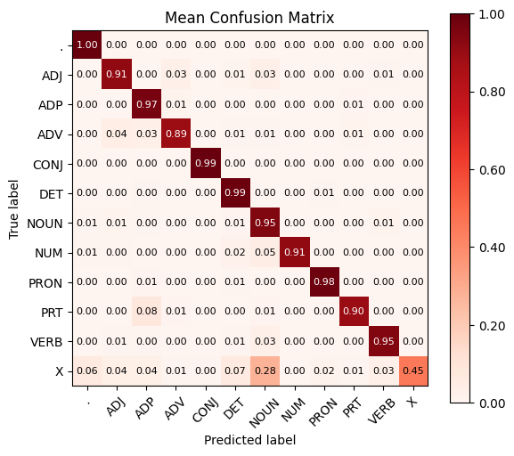

# POS Tagging by Hidden Markov Model

## Tools Installation
Ensure you have the required Python libraries installed by running the following commands:

```bash
pip install nltk
pip install scikit-learn
pip install numpy
pip install tqdm
pip install matplotlib
```

## Code
HMM.ipynb contains the code.


## Report
pos report.pdf contains the all the results and detailed error analysis.

## PPT
NLP_ass2_presentation.pptx

## Other files
Show the plots of results.

## Confusion Matrix


